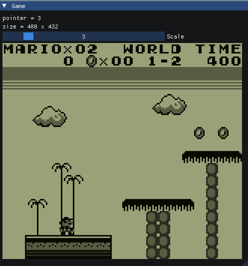
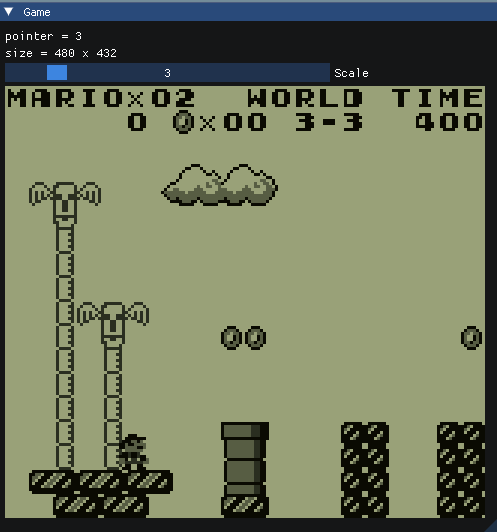
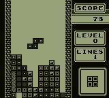
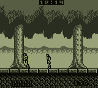
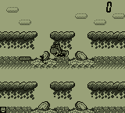
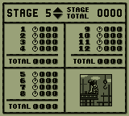
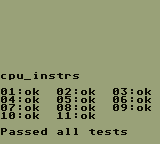
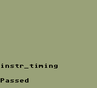
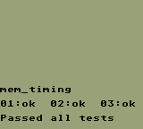
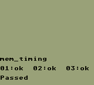

# Gameboy Emulator

This is a another Gameboy emulator written in C++. [Try Live Demo](https://gameboy.flylai.com)!

All the core components are implemented, including the CPU, PPU, APU, and MBCs, with cycle-accurate timing(not highly
accurate though).





## Build

Tested on Linux, but should work on other platforms.

### Requirements

* [CMake](https://cmake.org/)
* [GLFW](https://www.glfw.org/)
* [Emscripten](https://emscripten.org/) (WASM Build)

### Build

```bash
git clone --recursive https://github.com/flylai/gameboy.git
cd gameboy
mkdir build
cd build
cmake .. -DCMAKE_BUILD_TYPE=Release
# If you want to build to WASM, use the following command
# emcmake cmake .. -DCMAKE_BUILD_TYPE=Release
cmake --build . --parallel $(nproc)
```

## Usage

### General

```bash
./gameboy path/to/rom
```

### WASM

[Python3](https://www.python.org/downloads/) is Required.

```bash
# Copy the `simple_server.py` to your build folder
cp tools/simple_server.py ./build
python3 simple_server.py
```

Open your browser and visit [http://127.0.0.1:8000](http://127.0.0.1:8000), enjoy it!

## Controls

| Key   | Action |
|-------|--------|
| A     | Left   |
| W     | Up     |
| D     | Right  |
| S     | Down   |
| J     | A      |
| K     | B      |
| Enter | Start  |
| Space | Select |

## Screenshots

### Games







### Accuracy Tests







## Tests

The test report is generated by CI and can be found on [test_report](https://github.com/flylai/gameboy/tree/test_report)
branch.

## References & Credits

* [https://gbdev.io/pandocs/](https://gbdev.io/pandocs/)
* [https://gbdev.gg8.se/wiki/articles/Pan_Docs](https://gbdev.gg8.se/wiki/articles/Pan_Docs)
* [https://gbdev.io/gb-opcodes/optables/](https://gbdev.io/gb-opcodes/optables/)
* [https://rgbds.gbdev.io/docs/v0.8.0/gbz80.7](https://rgbds.gbdev.io/docs/v0.8.0/gbz80.7)
* [https://gb-archive.github.io/salvage/decoding_gbz80_opcodes/Decoding%20Gamboy%20Z80%20Opcodes.html](https://gb-archive.github.io/salvage/decoding_gbz80_opcodes/Decoding%20Gamboy%20Z80%20Opcodes.html)
* [https://gekkio.fi/files/gb-docs/gbctr.pdf](https://gekkio.fi/files/gb-docs/gbctr.pdf)
* [https://nightshade256.github.io/2021/03/27/gb-sound-emulation.html](https://nightshade256.github.io/2021/03/27/gb-sound-emulation.html)
* [https://www.reddit.com/r/EmuDev/comments/5gkwi5/comment/dat3zni/](https://www.reddit.com/r/EmuDev/comments/5gkwi5/comment/dat3zni/)
* [https://hacktix.github.io/GBEDG/](https://hacktix.github.io/GBEDG/)
